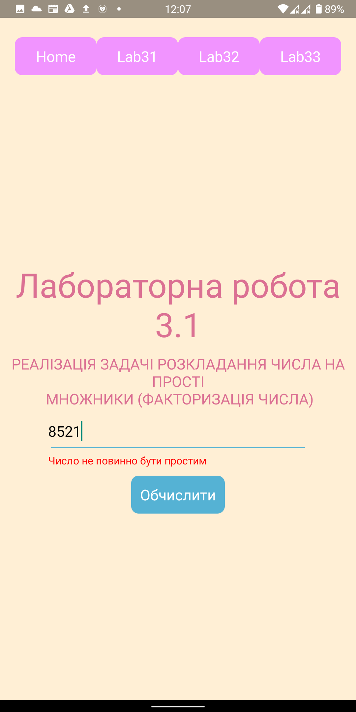
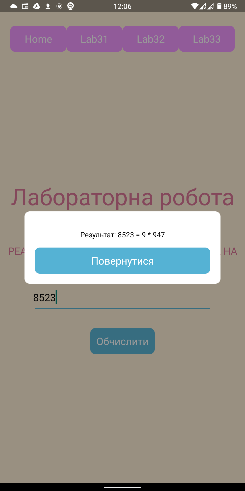
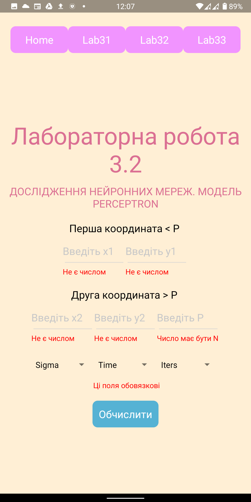
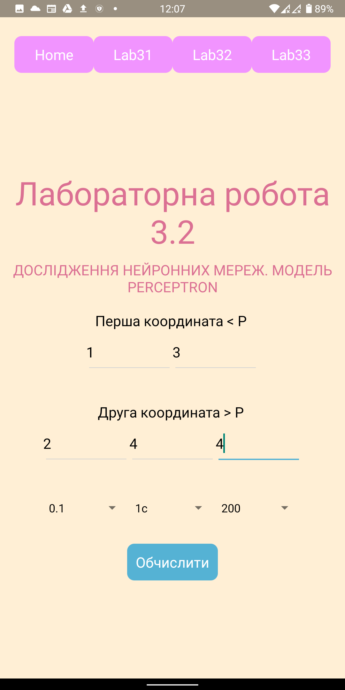
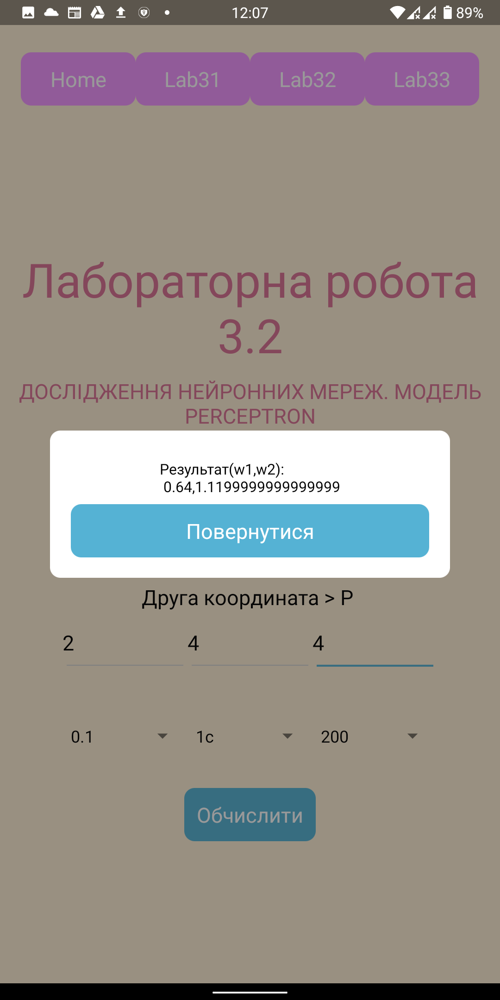
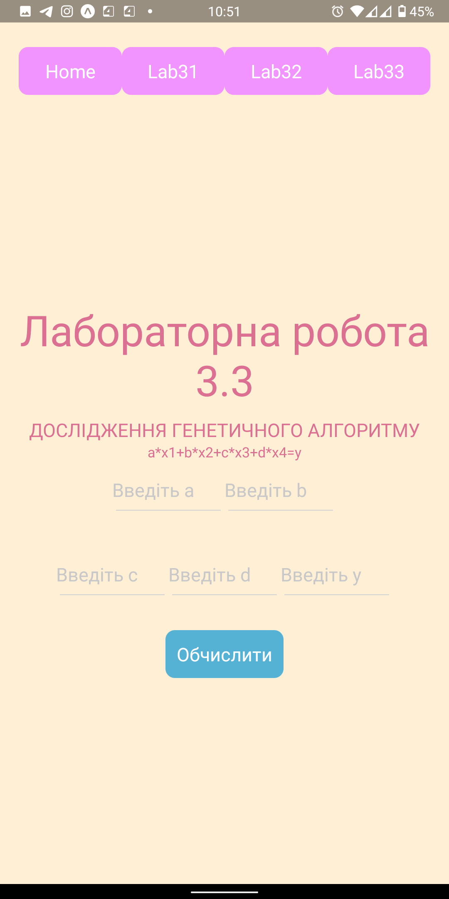
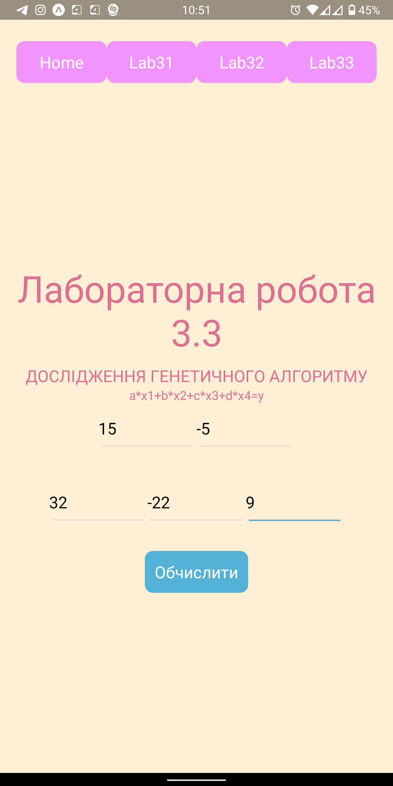
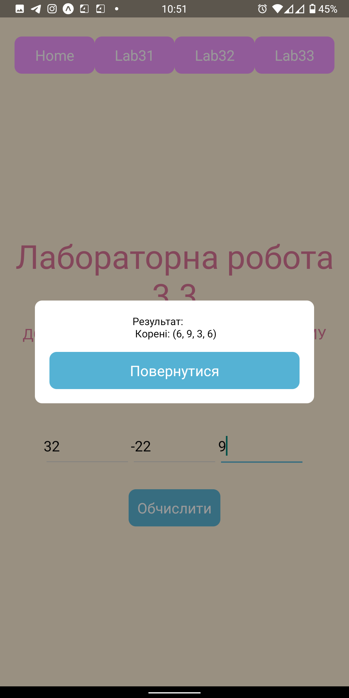

# rts-labs-3

Частина лабораторних робіт(3.1-3.3) з курсу систем реального часу  
Варіант - 24  

За бажанням можно перевірити виконання роботи 2 шляхами:  

1. завантажити та встановити на андроид-пристрій апк - <a href="https://drive.google.com/file/d/10R7YIlI3fiHyV-kAIajIfKwKNahvz3EL/view?usp=drivesdk">tap</a>
2. Зклонити репу(повинен бути встановлений yarn та expo) && перейти до кореню директорії && yarn install && yarn start  у вебі відкриється відповідне вікно, де можна буде запустити емулятор

Статус робіт:  
3.1 Перевірено 
3.2 Доп. завдання отримано(якщо програма виконується більше ніж 3 секунди вихід із програми). Перевірено. 
3.3 Доп. завдання поки отримано. Перевірено. 

Щодо 3.1 (ФАКТОРИЗАЦІЯ ЧИСЛА) 
алгоритм знаходиться у rts-labs-3/src/utils/factorization.js -> fermatsFactorizator 
скріни роботи: 
</img>
</img>

Щодо 3.2 (ДОСЛІДЖЕННЯ НЕЙРОННИХ МЕРЕЖ) 
алгоритм знаходиться у rts-labs/src/utils/perceptron.js -> calcPerceptron 
скріни роботи: 
</img>
</img>
</img>

Щодо 3.3 (ДОСЛІДЖЕННЯ ГЕНЕТИЧНОГО АЛГОРИТМУ) 
алгоритм знаходиться у rts-labs/src/utils/genetic/genetic.js -> calcGenetic 
скріни роботи: 
</img>
</img>
</img>
